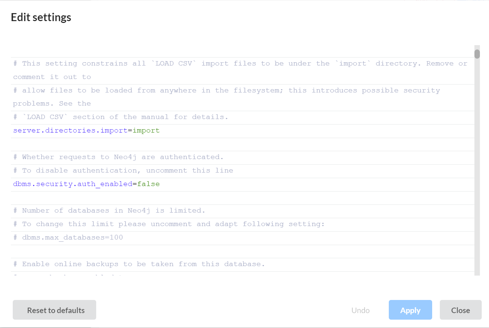

# CS-Capstone-Group-20

## ETD (Electronic Theses and Dissertations) Tools

This repository contains tools for working with Electronic Theses and Dissertations (ETDs) data in a Virtuoso triplestore database and Neo4j property graph database.
- Note: Other branches have version control and experiments used throughout project, but the main branch is the most up-to-date version

### Components

- **VirtuosoQueries.py**: Query tools for retrieving ETD metadata from the Virtuoso database.
- **VirtuosoLoader.py**: Tool for loading ETD metadata into the Virtuoso database.
- **Neo4j_Queries.py**: Query tools for retrieving ETD metadata from the Virtuoso database.
- **Neo4j_Loader.py**: Tool for loading ETD metadata into the Virtuoso database.
- **CSVtoJSON.py**: Converts CSV files into JSONs to be loaded into Neo4j
- **StreamUI.py**: GUI application for browsing and exploring ETDs.

- **Test_ETD_10.csv**: Example of CSV file used to load Neo4j
- **output_file_10.json**: Example of JSON file used to load Neo4j
- **users.json**: Stores usernames and passwords for access to StreamUI

### Known Issues

- **Read-Only Virtuoso Setup**: The Virtuoso database appears to be configured in read-only mode for the provided credentials. While SPARQL INSERT queries receive a 200 OK response, the data is not actually persisted in the database.
- **Neo4j_Loader.py** includes a permission check function that verifies whether write operations are being stored.
  - To fix this when running local Neo4j database: click three dots next to acgive DBSM > Settings > Change below line to match
  - 

### Usage

#### Loading ETDs (Note: Database is Read-Only)
- Virtuoso
```bash
python VirtuosoLoader.py 
```
- Neo4j
```bash
python CSVtoJSON.py Test_ETD.csv --out_file output_file.json
python Neo4j_Loader.py output_file.json
```

#### Running Local Webpage
```bash
streamlit run StreamUI.py
```
